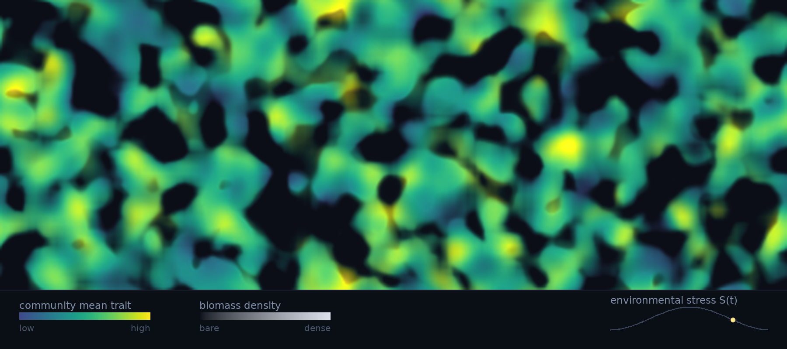

<picture>
  <source srcset="assets/metacommunity-regime-shift.webp" type="image/webp">
  
</picture>

<i>Conceptual simulation — a spatial metacommunity crossing a stress-driven regime shift. Colour: community-mean trait. Brightness: biomass density. <a href="visualization/README.md">How it was made →</a></i>

# Alexandros Kaminas

**PhD Researcher in Computational Ecology — University of Groningen**
 Theoretical & Evolutionary Community Ecology (Etienne group) · Evolutionary Systems Biology (Van Doorn group)

I develop computational models to understand how complex ecological systems behave. My research
asks how spatial structure and dispersal limitation shape the emergence, persistence and stability
of ecological communities. I build individual-based and spatially explicit simulations — and the
analytical tools to interrogate them — to study how local interactions, stochasticity and
environmental heterogeneity generate large-scale structure, and why such systems sometimes
reorganise abruptly rather than gradually.

### Current focus

Community assembly in fragmented landscapes · regime shifts and critical transitions ·
stochastic population dynamics · eco-evolutionary and trait-mediated interactions ·
functional and phylogenetic diversity

### Methods and tools

Individual-based and spatially explicit simulation · stochastic processes · numerical integration ·
sensitivity analysis · reproducible research workflows
 Working primarily in **R**, **Python**, **C++** and **LaTeX** — instruments for the science rather than an end in themselves.

### Selected work

**[spatial-eco-evolutionary-assembly](https://github.com/akaminas/spatial-eco-evolutionary-assembly)** — how biodiversity patterns emerge when ecology and evolution act together across a fragmented landscape; an individual-based metacommunity model coupling dispersal, environmental filtering, trait-mediated competition, mutation and disturbance. *Python.*

**[community-assembly-simulation](https://github.com/akaminas/community-assembly-simulation)** — how far stochasticity alone can account for local community composition; a birth–death–colonisation model of assembly from a regional species pool. *R.*

**[IBM_trait_adaptation](https://github.com/akaminas/IBM_trait_adaptation)** — whether populations can track a moving environmental optimum through heritable trait variation; a minimal individual-based model of adaptation under environmental change. *C++.*

### Elsewhere

[University of Groningen](https://research.rug.nl/en/persons/alexandros-kaminas/) ·
[Google Scholar](https://scholar.google.com/citations?user=jyVZ4m4AAAAJ) ·
[ORCID](https://orcid.org/0000-0002-7928-651X)
